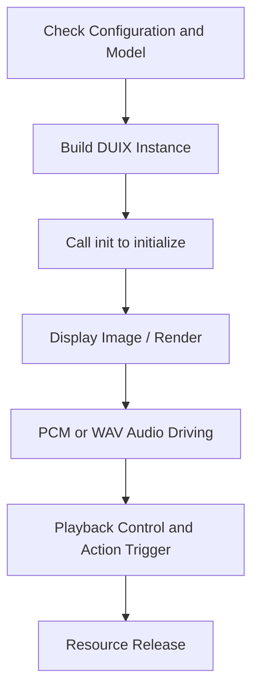

# Silicon-Based Digital Human SDK 

[简体中文](./README.md) | English

## 1. Product Introduction

The 2D Digital Human SDK allows for real-time driving of virtual humans via voice.

### 1.1 Applicable Scenarios

- **Low Deployment Cost**: No need for a technical team from the client side, supports low-cost, rapid deployment on multiple terminals and large screens.
- **Low Network Dependency**: Can be deployed in various scenarios like subways, banks, government services, etc., for virtual assistant self-service.
- **Diversified Functions**: Can meet diverse needs in industries like video, media, customer service, finance, broadcasting, etc., according to customer requirements.

### 1.2 Core Features

- **Customizable Image**: Supports custom virtual assistant images, offering both low-cost and in-depth image generation options.
- **Customizable Content Broadcasting**: Allows customization of broadcasting content, suitable for applications such as training and announcements.
- **Real-Time Interaction and Q&A**: Supports real-time conversations and the creation of custom Q&A libraries for consulting, casual conversations, virtual companionship, and customer service in specialized scenarios.

---

## 2. SDK Integration

### 2.1 Supported Systems and Hardware Versions

| Item                  | Description                                                                                                 |
|-----------------------|-------------------------------------------------------------------------------------------------------------|
| System                | Supports Android 10+ systems.                                                                               |
| CPU Architecture      | armeabi-v7a, arm64-v8a                                                                                      |
| Hardware Requirements | Requires CPU with 8 or more cores (Snapdragon 8 Gen 2), 8GB or more RAM, and 1GB or more available storage. |
| Network               | None (fully local operation)                                                                                |
| Development IDE       | Android Studio Giraffe \mid 2022.3.1 Patch 2                                                                |
| Memory Requirements   | Available memory for the digital human >= 800MB                                                             |

### 2.2 SDK Integration

Add the following configuration in the `build.gradle` file:

```gradle
dependencies {
    // Reference SDK project
    api project(":duix-sdk")
    ...
}
```

---

## 3. Usage Flow Overview



---

## 4. SDK Calls and API Description

### 4.1 Model Check and Download

Before using the rendering service, the basic configuration and model files must be synchronized to local storage. The SDK provides `VirtualModelUtil` for a simple demonstration of model download and decompression.

If the model download is too slow or fails, developers can opt to cache the model package to their own storage service.

> Function Definition: `ai.guiji.duix.sdk.client.VirtualModelUtil`

```
// Check if base configuration is downloaded
boolean checkBaseConfig(Context context)

// Check if model is downloaded
boolean checkModel(Context context, String name)

// Base configuration download
void baseConfigDownload(Context context, String url, ModelDownloadCallback callback)

// Model download
void modelDownload(Context context, String modelUrl, ModelDownloadCallback callback)
```

**ModelDownloadCallback**: `ai.guiji.duix.sdk.client.VirtualModelUtil$ModelDownloadCallback`

```
interface ModelDownloadCallback {
    // Download progress
    void onDownloadProgress(String url, long current, long total);
    // Decompression progress
    void onUnzipProgress(String url, long current, long total);
    // Download and decompression completed
    void onDownloadComplete(String url, File dir);
    // Download and decompression failed
    void onDownloadFail(String url, int code, String msg);
}
```

**Call Example**:

```kotlin
if (!VirtualModelUtil.checkBaseConfig(mContext)){
    VirtualModelUtil.baseConfigDownload(mContext, baseConfigUrl, callback)
}
```

```kotlin
if (!VirtualModelUtil.checkModel(mContext, modelUrl)){
    VirtualModelUtil.modelDownload(mContext, modelUrl, callback)
}
```

---

### 4.2 Initializing the SDK

In the `onCreate()` stage of the render page, create the DUIX object and call the `init` function.

> Function Definition: `ai.guiji.duix.sdk.client.DUIX`

```
// Create DUIX object
public DUIX(Context context, String modelName, RenderSink sink, Callback callback)

// Initialize DUIX service
void init()
```

**DUIX Object Construction Explanation**:

| Parameter  | Type       | Description                            |
|------------|------------|----------------------------------------|
| context    | Context    | System context                         |
| modelName  | String     | Can pass the model download URL (if downloaded) or the cached file name |
| render     | RenderSink | Render data interface, SDK provides a default render component that inherits this interface, or you can implement it yourself |
| callback   | Callback   | Various callbacks for SDK processing   |

**Callback Definition**: `ai.guiji.duix.sdk.client.Callback`

```
interface Callback {
    void onEvent(String event, String msg, Object info);
}
```

**Call Example**:

```kotlin
duix = DUIX(mContext, modelUrl, mDUIXRender) { event, msg, info ->
    when (event) {
        ai.guiji.duix.sdk.client.Constant.CALLBACK_EVENT_INIT_READY -> {
            initOK()
        }

        ai.guiji.duix.sdk.client.Constant.CALLBACK_EVENT_INIT_ERROR -> {
            initError()
        }
        // ...

    }
}
// Asynchronous callback result
duix?.init()
```

In the `init` callback, confirm the initialization result.

---

### 4.3 Displaying the Digital Human Image

Use the `RenderSink` interface to accept rendering frame data. The SDK provides an implementation of this interface in `DUIXRenderer.java`. You can also implement this interface yourself for custom rendering.

**RenderSink Definition**: `ai.guiji.duix.sdk.client.render.RenderSink`

```java
/**
 * Rendering pipeline, returns rendering data through this interface
 */
public interface RenderSink {

    // Frame data is arranged in BGR order
    void onVideoFrame(ImageFrame imageFrame);

}
```

**Call Example**:

Use `DUIXRenderer` and `DUIXTextureView` to implement simple rendering. The `DUIXTextureView` supports transparent channels to set the background and foreground freely.

```kotlin
override fun onCreate(savedInstanceState: Bundle?) {
    super.onCreate(savedInstanceState)
    // ...
    mDUIXRender =
        DUIXRenderer(
            mContext,
            binding.glTextureView
        )

    binding.glTextureView.setEGLContextClientVersion(GL_CONTEXT_VERSION)
    binding.glTextureView.setEGLConfigChooser(8, 8, 8, 8, 16, 0) // Transparent
    binding.glTextureView.isOpaque = false           // Transparent
    binding.glTextureView.setRenderer(mDUIXRender)
    binding.glTextureView.renderMode =
        GLSurfaceView.RENDERMODE_WHEN_DIRTY      // Must call after setting the renderer

    duix = DUIX(mContext, modelUrl, mDUIXRender) { event, msg, _ ->
    }
    // ...
}
```

---

### 4.4 Using PCM Streaming to Drive Digital Human Broadcasting

**PCM Format: 16k Sampling Rate, Mono, 16-bit Depth**

> Function Definition: `ai.guiji.duix.sdk.client.DUIX`

```
// Notify the service to start pushing audio
void startPush()

// Push PCM data
void pushPcm(byte[] buffer)

// Complete an audio push (call this function after the audio push is done, not after playback finishes).
void stopPush()

```

`startPush`, `pushPcm`, and `stopPush` need to be called in pairs. The `pushPcm` should not be too long. After a full segment of audio is pushed, use `stopPush` to end the current session and `startPush` again for the next segment.

**Call Example**:

```kotlin
val thread = Thread {
    duix?.startPush()
    val inputStream = assets.open("pcm/2.pcm")
    val buffer = ByteArray(320)
    var length = 0
    while (inputStream.read(buffer).also { length = it } > 0){
        val data = buffer.copyOfRange(0, length)
        duix?.pushPcm(data)
    }
    duix?.stopPush()
    inputStream.close()
}
thread.start()
```

---

### 4.5 Start WAV Audio to Drive Digital Human Broadcasting

> Function Definition: `ai.guiji.duix.sdk.client.DUIX`

```
void playAudio(String wavPath)
```

This function is compatible with the old WAV audio driving interface for digital humans but internally calls the PCM streaming method to drive the output.

**Parameter Description**:

| Parameter  | Type     | Description                              |
|------------|----------|------------------------------------------|
| wavPath    | String   | Local WAV file with a 16k sampling rate, mono, 16-bit depth |

**Call Example**:

```kotlin
duix?.playAudio(wavPath)
```

Audio playback status and progress callback:

```kotlin
object : Callback {
    fun onEvent(event: String, msg: String, info: Object) {
        when (event) {
            // ...

            "play.start" -> {
                // Start playing audio
            }

            "play.end" -> {
                // Audio playback completed
            }
            "play.error" -> {
                // Audio playback error
            }
        }
    }
}
```

---

### 4.6 Terminate Current Broadcasting

When the digital human is broadcasting, call this interface to terminate the broadcast.

> Function Definition: `ai.guiji.duix.sdk.client.DUIX`

```
boolean stopAudio();
```

**Call Example**:

```kotlin
duix?.stopAudio()
```

---

### 4.7 Play a Specified Action Interval

Models support new action interval annotations (SpecialAction.json).

> Function Definition: `ai.guiji.duix.sdk.client.DUIX`

```
/**
 * Play specified action interval
 * @param name Action interval name, which can be obtained from @{ModelInfo.getSilenceRegion()} after a successful init callback.
 * @param now Whether to play immediately: true for immediate playback, false for waiting until the current silent or action interval is complete.
 */
void startMotion(String name, boolean now)
```

**Call Example**:

```kotlin
duix?.startMotion("greet", true)
```

---

### 4.8 Play Random Action Interval

Randomly play scenes and old annotation protocols (config.json).

> Function Definition: `ai.guiji.duix.sdk.client.DUIX`

```
/**
 * Randomly play an action interval
 * @param now Whether to play immediately: true for immediate playback, false for waiting until the current silent or action interval is complete.
 */
void startRandomMotion(boolean now);
```

**Call Example**:

```kotlin
duix?.startRandomMotion(true)
```

---

## 5. Proguard Configuration

If obfuscation is used, please add the following in `proguard-rules.pro`:

```proguard
-keep class ai.guiji.duix.DuixNcnn{*; }
```

---

## 6. Notes

1. Ensure the basic configuration files and models are downloaded to the specified location before driving the rendering initialization.
2. The PCM audio played should not be too long, as the PCM buffer is cached in memory, and long audio streams may cause memory overflow.
3. Replace preview models by modifying the `modelUrl` value in the `MainActivity.kt` file and use the SDK's built-in file download and decompression management to obtain complete model files.
4. Audio driving format: 16k sampling rate, mono, 16-bit depth.
5. Insufficient device performance may cause audio feature extraction to fall behind the audio playback speed. You can use `duix?.setReporter()` to add a monitoring observer to track frame rendering information.

---

## 7. Version History

**<a>4.0.1</a>**
1. Supports PCM audio stream to drive the digital human, improving audio playback response time.
2. Optimized action interval playback, allowing specific action intervals based on model configuration.
3. Custom audio player, removing the Exoplayer dependency.
4. Provides a simplified model download synchronization management tool.

**<a>3.0.5</a>**

```text
1. Updated libonnxruntime.so version for arm32 CPU to fix compatibility issues.
2. Modified action interval playback function, allowing random and sequential playback, with manual stops to return to the silent interval.
```

**<a>3.0.4</a>**

```text
1. Fixed image rendering issues due to low precision in GL floats on some devices.
```

**<a>3.0.3</a>**

```text
1. Optimized local rendering.
```

## 8. Other Related Open-Source Projects

| Module  | Description                         |
|---------|-------------------------------------|
| [onnx](https://github.com/onnx/onnx) | AI Framework                        |
| [ncnn](https://github.com/Tencent/ncnn) | High-performance Neural Network Framework |

---
