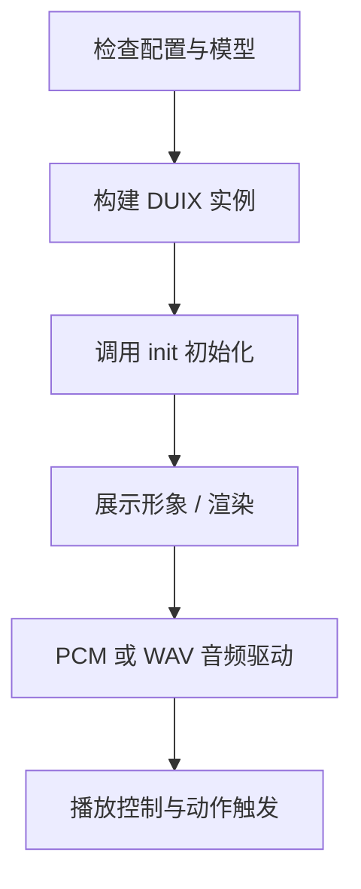

## 硅基本地版DUIX-PRO SDK使⽤⽂档 (1.2.0)

简体中文 | [English](./README_en.md)

---

## 一、产品概述

`硅基本地版 DUIX-PRO SDK` 是一套轻量级的本地部署 2D 虚拟人解决方案，支持通过语音实时驱动虚拟人形象。该 SDK 可在 iOS 设备上运行，具备低延迟、高帧率、边缘计算离线运行等优势。

### 1.1 适用场景

- **部署成本低**：无需服务端支持，适合大屏终端、本地 App 快速集成；
- **网络依赖小**：本地模型运行，支持政务大厅、展厅、机场等弱网环境；
- **功能多样化**：适用于导览播报、业务咨询、数字迎宾等 AI 数字人应用场景。

### 1.2 核心功能

- **数字人渲染与驱动**：支持本地渲染虚拟人形象，响应语音输入实时口型驱动；
- **语音播报控制**：支持音频播放、PCM 推流、动作与播报联动；
- **动作控制系统**：可自定义启动、停止、随机动作；

本 SDK 提供本地部署的 2D 数字人渲染及语音播报能力，适用于 iOS 12+ 版本的设备。支持语音驱动数字人形象的实时呈现，具备低延迟、低功耗、高性能等特点。

---


## 二、开发准备

- **SDK 组件**：`GJLocalDigitalSDK.framework`（设置为 Embed & Sign）
- **开发环境**：
  - Xcode 12 及以上
  - iPhone 8 及以上设备
  - iOS 12.0+

---


## 三、调用流程



```
1.准备资源：同步数字人所需的基础配置和模型文件

2.初始化服务：initBaseModel:digitalModel:showView:

3.启动渲染：toStart:

4.驱动播报：toWavPcmData:（流式驱动）

5.停止播报：stopPlaying:（主动停止）

6.释放资源：toStop（结束渲染）
```

---

## 四、快速开始
```
NSInteger result = [[GJLDigitalManager manager] initBaseModel:weakSelf.basePath 
                                                 digitalModel:weakSelf.digitalPath 
                                                    showView:weakSelf.showView];

if (result == 1) {
    // 2. 启动渲染
    [[GJLDigitalManager manager] toStart:^(BOOL isSuccess, NSString *errorMsg) {
        if (isSuccess) {
            dispatch_async(dispatch_get_main_queue(), ^{
                // 3. 启动流式驱动
                [[GJLDigitalManager manager] toStartRuning];
            });
        } else {
            [SVProgressHUD showInfoWithStatus:errorMsg];
        }
    }];
}


```

---

## 五、核心功能接口


### 5.1 初始化配置

```
/**
 * 初始化数字人服务
 * @param basePath    基础模型路径（固定不变）
 * @param digitalPath 数字人模型路径（替换数字人时更新此路径）
 * @param showView    数字人渲染视图
 * @return 状态码 1=成功, 0=未授权, -1=失败
 */
-(NSInteger)initBaseModel:(NSString*)basePath digitalModel:(NSString*)digitalPath showView:(UIView*)showView;
```


### 5.2 渲染数字人控制

```
/*
*启动数字人渲染
*/
-(void)toStart:(void (^) (BOOL isSuccess, NSString *errorMsg))block;
```


```
/*
*停止渲染并释放资源
*/
-(void)toStop;
```


```
/*
*恢复播放（暂停后调用）
*/
-(void)toPlay;
```

```
/*
*暂停数字人播放
*/
-(void)toPause;
```


### 5.3 背景管理

```
/**
 * 动态替换背景
 * @param bbgPath JPG格式背景图路径
 */
-(void)toChangeBBGWithPath:(NSString*)bbgPath;
```


### 5.4 音频控制

```
/*
*audioData播放音频流 ，参考demo里面GJLPCMManager类里toSpeakWithPath 转换成pcm的代码
*驱动数字人播报(PCM流)
*/
-(void)toWavPcmData:(NSData*)audioData;
```

```
/*
* 开始音频流播放
*/
- (void)startPlaying;
```


```
/*
* 结束音频流播放
*/
- (void)stopPlaying:(void (^)( BOOL isSuccess))success;
```


```
/*
*设置静音模式
*/
-(void)toMute:(BOOL)isMute;
```

```
/*
*清空音频缓冲区
*/
-(void)clearAudioBuffer;
```

```
/*
*暂停播放音频流
*/
-(void)toPausePcm;
```


```
/*
*恢复播放音频流
*/
-(void)toResumePcm;
```

```
/*
* 是否启用录音
*/
-(void)toEnableRecord:(BOOL)isEnable;
```


### 5.5 流式会话管理
```
/*
*启动流式会话
*/
-(void)toStartRuning;
```

```
/*
*开始新会话（单句/段落）
*/
-(void)newSession;
```

```
/*
*结束当前会话
*/
-(void)finishSession;
```


```
/*
*继续会话（finish后调用）
*/
-(void)continueSession;
```


### 5.6 动作控制

```
/*
* 启用随机动作（建议在首段音频开始时调用）
* 返回：0=不支持, 1=成功
*/
-(NSInteger)toRandomMotion;
```

```
/*
* 启用开始动作（首段音频开始时调用）
* 返回：0=不支持, 1=成功
*/
-(NSInteger)toStartMotion;
```

```
/*
* 结束动作（末段音频结束时调用）
*isQuickly: YES=立即结束, NO=等待动作完成
*返回：0=不支持, 1=成功
*/
-(NSInteger)toSopMotion:(BOOL)isQuickly;
```

### 5.7 状态查询

```
/*
*获取数字人模型尺寸（需初始化后调用）
*/ 
-(CGSize)getDigitalSize;
```

```
/*
*检查授权状态（1=已授权）
*/ 
-(NSInteger)isGetAuth;
```

---

## 六、回调定义

```
/*
*数字人渲染报错
*错误码说明：
*    0  = 未授权 
*   -1 = 未初始化 
*   50009 = 资源超时/未配置
*/
@property (nonatomic, copy) void (^playFailed)(NSInteger code,NSString *errorMsg);

/*
*音频播放结束回调
*/
@property (nonatomic, copy) void (^audioPlayEnd)(void);

/*
*音频播放进度回调
/
@property (nonatomic, copy) void (^audioPlayProgress)(float current,float total);
```

---

## 七、版本更新记录

### v1.2.0

- 新增 PCM 推流支持

### v1.0.3

- 支持透明背景
- 优化模型解压内存

### v1.0.2

- 支持问答 / 语音识别 / 动作标注 / 合成播报

### v1.0.1

- 初始版本：授权 + 渲染 + 播报

---

## 八、参考开源项目

| 模块                                      | 描述              |
| --------------------------------------- | --------------- |
| [ONNX](https://github.com/onnx/onnx)    | 通用人工智能模型格式      |
| [ncnn](https://github.com/Tencent/ncnn) | 高性能神经网络推理框架（腾讯） |

---

如需更多集成帮助，请联系技术支持。
