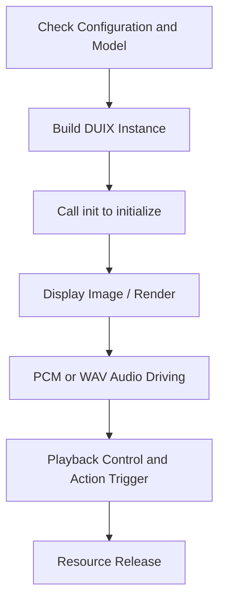

# GJLocalDigitalSDK Documentation (v1.2.0)

English | [简体中文](./GJLocalDigitalSDK.md)

---

## 1. Product Overview

`GJLocalDigitalSDK` is a lightweight local deployment solution for 2D virtual humans that supports real-time driving of virtual characters through voice. This SDK runs on iOS devices and features low latency, high frame rate, and edge computing capabilities for offline operation.

### 1.1 Applicable Scenarios

- **Low Deployment Cost**: No server support required, suitable for large-screen terminals and quick integration into local apps
- **Minimal Network Dependency**: Runs locally, ideal for weak network environments like government halls, exhibition centers, and airports
- **Diverse Functionality**: Applicable for AI digital human scenarios such as guided tours, business consulting, and digital reception

### 1.2 Core Features

- **Digital Human Rendering & Driving**: Local rendering of virtual characters with real-time lip-syncing to voice input
- **Voice Broadcast Control**: Supports audio playback, PCM streaming, and action-broadcast coordination
- **Motion Control System**: Customizable start, stop, and random actions

This SDK provides locally deployed 2D digital human rendering and voice broadcast capabilities for devices running iOS 12+. It supports real-time presentation of voice-driven digital humans with low latency, low power consumption, and high performance.

---

## 2. Development Preparation

- **SDK Component**: `GJLocalDigitalSDK.framework` (Set to Embed & Sign)
- **Development Environment**:
  - Xcode 12+
  - iPhone 8+ devices
  - iOS 12.0+

---

## 3. Quick Start

```
// 1. Initialize authorization
NSInteger result = [[GJLDigitalManager manager] initBaseModel:weakSelf.basePath 
                                                 digitalModel:weakSelf.digitalPath 
                                                    showView:weakSelf.showView];

if (result == 1) {
    // 2. Start rendering
    [[GJLDigitalManager manager] toStart:^(BOOL isSuccess, NSString *errorMsg) {
        if (isSuccess) {
            dispatch_async(dispatch_get_main_queue(), ^{
                // 3. Start streaming driver
                [[GJLDigitalManager manager] toStartRuning];
            });
        } else {
            [SVProgressHUD showInfoWithStatus:errorMsg];
        }
    }];
}

```

---

##  4. Workflow



```
1. Prepare resources: Synchronize base configurations and model files required for the digital human

2. Initialize service: initBaseModel:digitalModel:showView:

3. Start rendering: toStart:

4. Drive broadcast: toWavPcmData: (streaming-driven)

5. Stop broadcast: stopPlaying: (active stop)

6. Release resources: toStop (stop rendering)
```

---

## 5. Core Function Interfaces

### 5.1 Initialization Configuration

```
/**
 * Initialize digital human service
 * @param basePath    Base model path (fixed)
 * @param digitalPath Digital human model path (update when replacing digital human)
 * @param showView    Digital human rendering view
 * @return Status code 1=success, 0=unauthorized, -1=failure
 */
-(NSInteger)initBaseModel:(NSString*)basePath digitalModel:(NSString*)digitalPath showView:(UIView*)showView;
```

### 5.2 Digital Human Rendering Control

```
/*
* Start digital human rendering
*/
-(void)toStart:(void (^) (BOOL isSuccess, NSString *errorMsg))block;
```

```
/*
* Stop rendering and release resources
*/
-(void)toStop;
```

```
/*
* Resume playback (call after pause)
*/
-(void)toPlay;
```

```
/*
* Pause digital human playback
*/
-(void)toPause;
```

### 5.3 Background Management

```
/**
 * Dynamically replace background
 * @param bbgPath JPG format background image path
 */
-(void)toChangeBBGWithPath:(NSString*)bbgPath;
```

### 5.4 Audio Control

```
/*
* Play audio stream (PCM format), refer to toSpeakWithPath in GJLPCMManager demo class for PCM conversion
* Drive digital human broadcast (PCM stream)
*/
-(void)toWavPcmData:(NSData*)audioData;
```


```
/*
* Start audio stream playback
*/
- (void)startPlaying;
```

```
/*
* Stop audio stream playback
*/
- (void)stopPlaying:(void (^)( BOOL isSuccess))success;
```

```
/*
* Set mute mode
*/
-(void)toMute:(BOOL)isMute;
```

```
/*
* Clear audio buffer
*/
-(void)clearAudioBuffer;
```

```
/*
* Pause audio stream playback
*/
-(void)toPausePcm;
```

```
/*
* Resume audio stream playback
*/
-(void)toResumePcm;
```

```
/*
* Enable/disable recording
*/
-(void)toEnableRecord:(BOOL)isEnable;
```

### 5.5 Streaming Session Management

```
/*
* Start streaming session
*/
-(void)toStartRuning;
```

```
/*
* Start new session (single sentence/paragraph)
*/
-(void)newSession;
```

```
/*
* End current session
*/
-(void)finishSession;
```

```
/*
* Continue session (call after finish)
*/
-(void)continueSession;
```

### 5.6 Motion Control

```
/*
* Enable random motions (recommended at start of first audio segment)
* Return: 0=unsupported, 1=success
*/
-(NSInteger)toRandomMotion;
```

```
/*
* Enable start motion (call at beginning of first audio segment)
* Return: 0=unsupported, 1=success
*/
-(NSInteger)toStartMotion;
```

```
/*
* End motion (call at end of last audio segment)
* isQuickly: YES=end immediately, NO=wait for motion completion
* Return: 0=unsupported, 1=success
*/
-(NSInteger)toSopMotion:(BOOL)isQuickly;
```


### 5.7 Status Queries
```
/*
* Get digital human model dimensions (call after initialization)
*/ 
-(CGSize)getDigitalSize;
```

```
/*
* Check authorization status (1=authorized)
*/ 
-(NSInteger)isGetAuth;
```
---

## 6. Callback Definitions

```
/*
* Digital human rendering error
* Error codes:
*    0  = Unauthorized 
*   -1 = Uninitialized 
*   50009 = Resource timeout/unconfigured
*/
@property (nonatomic, copy) void (^playFailed)(NSInteger code,NSString *errorMsg);
```

```
/*
* Audio playback ended callback
*/
@property (nonatomic, copy) void (^audioPlayEnd)(void);
```

```
/*
* Audio playback progress callback
*/
@property (nonatomic, copy) void (^audioPlayProgress)(float current,float total);
```
---

## 7. Version History

### v1.2.0

- Added PCM streaming support

### v1.0.3

- Supported transparent backgrounds
- Optimized model decompression memory

### v1.0.2

- Supported Q&A / speech recognition / motion tagging / synthesized broadcast

### v1.0.1

- Initial version: authorization + rendering + broadcast
---

## 8. Reference Open-Source Projects
| Module                                     | Description              |
| --------------------------------------- | --------------- |
| [ONNX](https://github.com/onnx/onnx)    | Universal AI model format      |
| [ncnn](https://github.com/Tencent/ncnn) | High-performance neural network inference framework (Tencent)
 |
 
 
 For additional integration support, please contact technical support.
